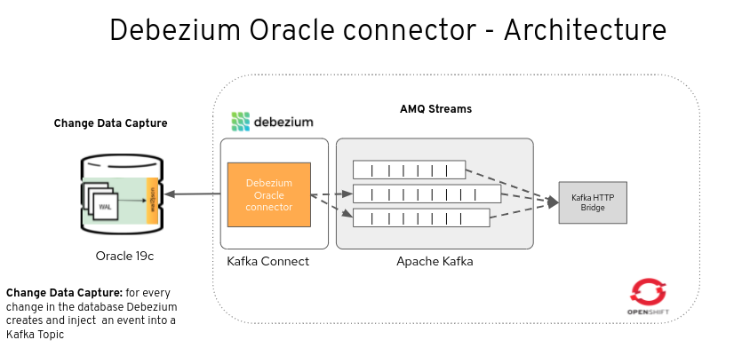

= Debezium Oracle Connector demo

This demo for Red Hat Streams (Kafka) will show how to replicate data and
data changes from a Oracle database with Debezium into Kafka cluster 
using the Debezium Oracle Connector and the LogMiner Oracle functionality.

== Prerequisites

To run this demo you need to have an OpenShift cluster up and running and
a user with sufficient rights on that cluster.

=== Setup Project `appdev-kafka`
Setup a namespace for this example, e.g. this demo uses "appdev-kafka":

[source,console]
----
oc new-project appdev-kafka --display-name="Debezium AMQ Streams"
----
=== Setup Red Hat Container Registry Secret

For downloading the AMQ Streams Kafka container image in the next step,
a Registry Service Account must be created on the Red Hat Customer Portal
in the https://access.redhat.com/terms-based-registry/[Registry Service Accounts]
section.

== Installation and Configuration

The demo consist of all these components:

* Oracle 19c: the source database.

* Debezium Oracle Connector: changes from one database table are written to a Kafka topic whose name corresponds to the table name.

*  AMQ stream cluster: a real time event streaming platform.

* In addition, for monitoring Debezium together with all the components we deploy: 
**  Prometheus: provides an open source set of components for systems monitoring and alert notification.
**  Grafana: provides visualizations of Prometheus metrics.

=== Install Red Hat AMQ Streams (Strimzi Operator)

[NOTE]
====
In order to add Strimzi Operator the user needs to have right to add
CustomResourceDefinition objects.
====

[source,console]
----
oc apply -f 01-kafka-event-broker.yml -n appdev-kafka
----

For further installation options, like using the OpenShift OperatorHub,
look at https://access.redhat.com/documentation/en-us/red_hat_amq/2020.q4/html/deploying_and_upgrading_amq_streams_on_openshift/deploy-intro_str#con-streams-installation-methods_str[AMQ Streams installation methods].

Next command addresses an issue with the persisten volume creation (might be unnecessary).

[source,console]
----
oc adm policy add-scc-to-user anyuid system:serviceaccount:appdev-kafka:default
----

=== Setup demo databases
This demo uses the Debezium Oracle Example database, and an empty SQL Server database as the destination.

==== Oracle
Please follow this blog to install a configure the Oracle Database: https://debezium.io/blog/2022/09/30/debezium-oracle-series-part-1/

==== Debezium Oracle Connector

[source,console]
----
oc apply -f 02-Kafka-connect.yaml -n appdev-kafka
oc apply -f 03-kafka-oracle-connector.yaml -n appdev-kafka
----

==== SQL commands for testing 

[source,console]
----
CREATE TABLE customers1 (id number(9,0) primary key, name varchar2(50), city varchar2(50));
INSERT INTO customers1 VALUES (1001, 'Salles Thomas','Cairo');
INSERT INTO customers1 VALUES (1002, 'George Bailey','Barcelona');
INSERT INTO customers1 VALUES (1003, 'Edward Walker','Paris');
INSERT INTO customers1 VALUES (1004, 'Anne Kretchmar','Brussels');
COMMIT;

INSERT INTO customers1 VALUES (1009, 'Leo Messi','Barcelona');
COMMIT;

update customers1 set city= 'Girona' where id=1009;
COMMIT;
----
